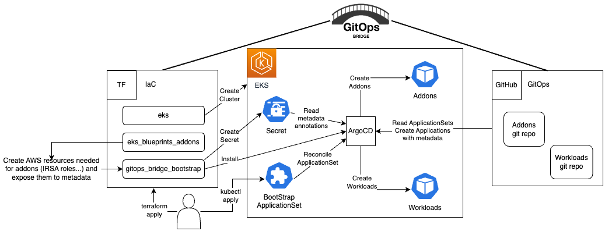

# ArgoCD on Amazon EKS

This tutorial guides you through deploying an Amazon EKS cluster with addons configured via ArgoCD, employing the [GitOps Bridge Pattern](https://github.com/gitops-bridge-dev).



The [GitOps Bridge Pattern](https://github.com/gitops-bridge-dev) enables Kubernetes administrators to utilize Infrastructure as Code (IaC) and GitOps tools for deploying Kubernetes Addons and Workloads. Addons often depend on Cloud resources that are external to the cluster. The configuration metadata for these external resources is required by the Addons' Helm charts. While IaC is used to create these cloud resources, it is not used to install the Helm charts. Instead, the IaC tool stores this metadata either within GitOps resources in the cluster or in a Git repository. The GitOps tool then extracts these metadata values and passes them to the Helm chart during the Addon installation process. This mechanism forms the bridge between IaC and GitOps, hence the term "GitOps Bridge."

## Prerequisites

Before you begin, make sure you have the following command line tools installed:

- git
- terraform
- kubectl
- argocd

## (Optional) Fork the GitOps git repositories

See the appendix section [Fork GitOps Repositories](#fork-gitops-repositories) for more info on the terraform variables to override.

## Deploy the EKS Cluster

Initialize Terraform and deploy the EKS cluster:

```shell
terraform init
terraform apply -target="module.vpc" -auto-approve
terraform apply -target="module.eks" -auto-approve
terraform apply -auto-approve
```

To retrieve `kubectl` config, execute the terraform output command:

```shell
terraform output -raw configure_kubectl
```

The expected output will have two lines you run in your terminal

```text
export KUBECONFIG="/tmp/eks-gitops"
aws eks --region eu-west-1 update-kubeconfig --name eks-gitops --profile mfa
```

>The first line sets the `KUBECONFIG` environment variable to a temporary file
that includes the cluster name. The second line uses the `aws` CLI to populate
that temporary file with the `kubectl` configuration. This approach offers the
advantage of not altering your existing `kubectl` context, allowing you to work
in other terminal windows without interference.

Terraform will add GitOps Bridge Metadata to the ArgoCD secret.
The annotations contain metadata for the addons' Helm charts and ArgoCD ApplicationSets.

```shell
kubectl get secret -n argocd -l argocd.argoproj.io/secret-type=cluster -o json | jq '.items[0].metadata.annotations'
```

The output looks like the following:

```json
{
  "addons_repo_basepath": "argocd/",
  "addons_repo_path": "bootstrap/control-plane/addons",
  "addons_repo_revision": "main",
  "addons_repo_url": "https://github.com/0x1v4n/eks-addons",
  "aws_account_id": "0123456789",
  "aws_cluster_name": "eks-gitops",
  "aws_region": "eu-west-1",
  "aws_vpc_id": "vpc-001d3f00151bbb731",
  "cluster_name": "in-cluster",
  "environment": "dev",
  "workload_repo_basepath": "",
  "workload_repo_path": "k8s",
  "workload_repo_revision": "main",
  "workload_repo_url": "https://github.com/0x1v4n/eks-gitops"
}
```

The labels offer a straightforward way to enable or disable an addon in ArgoCD for the cluster.

```shell
kubectl get secret -n argocd -l argocd.argoproj.io/secret-type=cluster -o json | jq '.items[0].metadata.labels' | grep -v false | jq .
```

The output looks like the following:

```json
{
  "argocd.argoproj.io/secret-type": "cluster",
  "aws_cluster_name": "eks-gitops",
  "cluster_name": "in-cluster",
  "enable_argo_rollouts": "true",
  "enable_argocd": "true",
  "enable_kube_prometheus_stack": "true",
  "environment": "dev",
  "kubernetes_version": "1.28"
}
```

## Deploy the Addons

Bootstrap the addons using ArgoCD:

```shell
kubectl apply --server-side -f bootstrap/addons.yaml
```

### Monitor GitOps Progress for Addons

Wait until all the ArgoCD applications' `HEALTH STATUS` is `Healthy`.
Use `Ctrl+C` or `Cmd+C` to exit the `watch` command. ArgoCD Applications
can take a couple of minutes in order to achieve the Healthy status.

```shell
kubectl get applications -n argocd -w
```

The expected output should look like the following:

```text
NAME                                     SYNC STATUS   HEALTH STATUS
addon-in-cluster-argo-cd                 Synced        Healthy
addon-in-cluster-argo-rollouts           Synced        Healthy
cluster-addons                           Synced        Healthy
```

### Verify the Addons

Verify that the addons are ready:

```shell
kubectl get deploy -n argocd \
  argo-cd-argocd-applicationset-controller \
  argo-cd-argocd-repo-server \
  argo-cd-argocd-server
```

The expected output should look like the following:

```text
NAME                                       READY   UP-TO-DATE   AVAILABLE   AGE
argo-cd-argocd-applicationset-controller   1/1     1            1           109m
argo-cd-argocd-repo-server                 1/1     1            1           109m
argo-cd-argocd-server                      1/1     1            1           109m
```

## (Optional) Access ArgoCD

Access to the ArgoCD's UI is completely optional, if you want to do it,
run the commands shown in the Terraform output as the example below:

```shell
terraform output -raw access_argocd
```

The expected output should contain the config to retrieve the URL, username, password to login into ArgoCD UI.

```text
echo "ArgoCD Username: admin"
echo "ArgoCD Password: $(kubectl get secrets argocd-initial-admin-secret -n argocd --template="{{index .data.password | base64decode}}")"

export REGION="eu-west-1"
export PROFILE="mfa"
export INSTANCE_ID="i-06480eadb1cfd9d3d"
export ARGOCD_NODE_IP=$(kubectl get pod -n argocd \
  -l app.kubernetes.io/name=argocd-server \
  -o jsonpath='{.items[0].status.hostIP}')

To open the SSM port-forwarding tunnel to ArgoCD:
aws ssm start-session \
  --target "$INSTANCE_ID" \
  --document-name AWS-StartPortForwardingSessionToRemoteHost \
  --parameters "{\"host\":[\"$ARGOCD_NODE_IP\"],\"portNumber\":[\"32080\"],\"localPortNumber\":[\"8080\"]}" \
  --region "$REGION" \
  --profile "$PROFILE"

Then access ArgoCD at: http://localhost:8080
```

## Deploy the Workloads

Deploy a sample application located in [k8s/game-2048.yaml](k8s/game-2048.yaml) using ArgoCD:

```shell
kubectl apply --server-side -f bootstrap/workloads.yaml
```

### Monitor GitOps Progress for Workloads

Wait until all the ArgoCD applications' `HEALTH STATUS` is `Healthy`.
Use `Ctrl+C` or `Cmd+C` to exit the `watch` command. ArgoCD Applications
can take a couple of minutes in order to achieve the Healthy status.

```shells
watch kubectl get -n argocd applications workloads
```

The expected output should look like the following:

```text
NAME        SYNC STATUS   HEALTH STATUS
workloads   Synced        Healthy
```

### Verify the Application

Verify that the application configuration is present and the pod is running:

```shell
kubectl get -n game-2048 deployments,service,ep
```

The expected output should look like the following:

```text
NAME                        READY   UP-TO-DATE   AVAILABLE   AGE
deployment.apps/game-2048   1/1     1            1           2m9s

NAME                TYPE       CLUSTER-IP       EXTERNAL-IP   PORT(S)        AGE
service/game-2048   NodePort   172.20.118.252   <none>        80:31427/TCP   2m9s

NAME                  ENDPOINTS        AGE
endpoints/game-2048   10.0.13.227:80   2m9s
```

### Access the Application Using AWS SSM Port Forwarding

Reach the NodePort service through an AWS SSM port-forwarding session.

#### Prerequisites

- **`$INSTANCE_ID`**: ID of the EC2 instance running in the public subnet.
- **`$APP_NODE_IP`**: Private IP of the Kubernetes node where the game pod is scheduled.
- **`$REGION`**: AWS region (e.g., eu-west-1). 
- **`$PROFILE`**: Your AWS CLI profile name. 

To get the private node IP hosting the game-2048 pod, run:

```shell
kubectl get pod -n game-2048 -o wide
```

You’ll see output like:

```text
NAME                         READY   STATUS    RESTARTS   AGE   IP           NODE
game-2048-66fb78b995-jnstq   1/1     Running   0          15m   10.0.27.49   ip-10-0-27-29.eu-west-1.compute.internal
```

Then extract the NODE name and resolve its internal IP with:

```shell
export APP_NODE_IP=$(kubectl get pod -n game-2048 \
  -l app.kubernetes.io/name=game-2048 \
  -o jsonpath='{.items[0].status.hostIP}')
```

#### Start the port-forwarding session

```shell
aws ssm start-session \
  --target "$INSTANCE_ID" \
  --document-name AWS-StartPortForwardingSessionToRemoteHost \
  --parameters "{\"host\":[\"$APP_NODE_IP\"],\"portNumber\":[\"31427\"],\"localPortNumber\":[\"8081\"]}" \
  --region "$REGION" \
  --profile "$PROFILE"
```
Once the session is active, open your browser at: [http://localhost:8081](http://localhost:8081)

## Destroy the EKS Cluster

To tear down all the resources and the EKS cluster, run the following command:

```shell
./destroy.sh
```

## Appendix

## Fork GitOps Repositories

To modify the `values.yaml` file for addons or the workload manifest files (.ie yaml), you'll need to fork two repositories: [0x1v4n/eks-addons](https://github.com/0x1v4n/eks-addons) for addons and [github.com/0x1v4n/eks-gitops](https://github.com/0x1v4n/eks-gitops) for workloads located in this pattern directory.

After forking, update the following environment variables to point to your forks, replacing the default values.

```shell
export TF_VAR_gitops_addons_org=https://github.com/0x1v4n
export TF_VAR_gitops_addons_repo=eks-addons
export TF_VAR_gitops_addons_revision=main

export TF_VAR_gitops_workload_org=https://github.com/0x1v4n
export TF_VAR_gitops_workload_repo=eks-gitops
export TF_VAR_gitops_workload_revision=main
```
